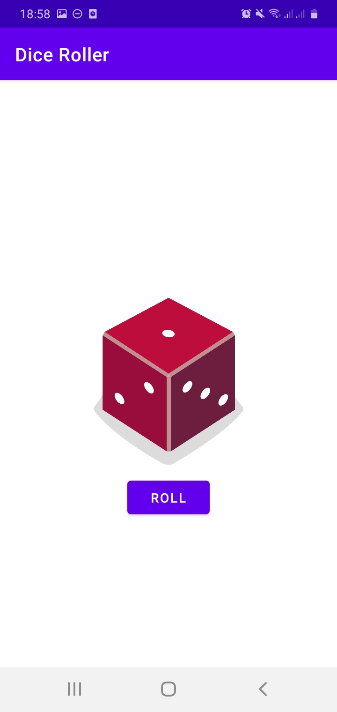

# DiceRoller

Atividade de Programação Mobile, O objetivo é clicar no botão e depois disso irá gerar um número do dado aleatorio ᕙ(`▿´)ᕗ 

### Linguagens usadas [ Languages used ]

           Kotlin <!--❤️--> ✔

  

